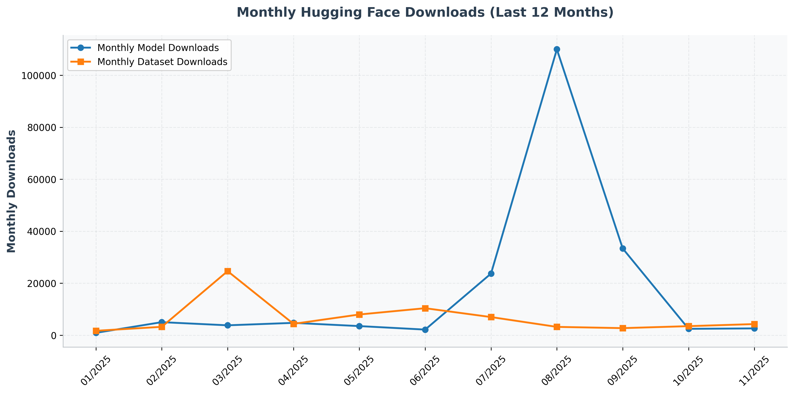

# Hi, there is [Liang's Lab](https://ins.sjtu.edu.cn/people/lhong/index.html) 👋

 <!-- 🔄 stars -->
 <!-- 🔄 forks -->
 <!-- 🔄 total_hf_models -->
 <!-- 🔄 total_hf_datasets -->

Research on protein-directed modification and redesign based on artificial intelligence technology.  
The research content includes but is not limited to protein structure prediction and optimization, protein-directed modification, and design.

## 🤖 Online AI Tools
- 2025.08:  🎉 VenusFactory releases a **free** website at [venusfactory.cn](http://venusfactory.cn/).

## 🎈 Recent Papers
- [VenusFactory: An Integrated System for Protein Engineering with Data Retrieval and Language Model Fine-Tuning](https://aclanthology.org/2025.acl-demo.23/). *ACL Demo*, 2025.
- [From high-throughput evaluation to wet-lab studies: advancing mutation effect prediction with a retrieval-enhanced model](https://academic.oup.com/bioinformatics/article/41/Supplement_1/i401/8199374?login=false). *ISMB/ECCB*, 2025.
- [Immunogenicity Prediction with Dual Attention Enables Vaccine Target Selection](https://openreview.net/forum?id=hWmwL9gizZ). *ICLR*, 2025.
- [VenusMutHub: A systematic evaluation of protein mutation effect predictors on small-scale experimental data](https://www.sciencedirect.com/science/article/pii/S2211383525001650). *Acta Pharmaceutica Sinica B*, 2025.

## 📈 Hugging Face Downloads Over Time

